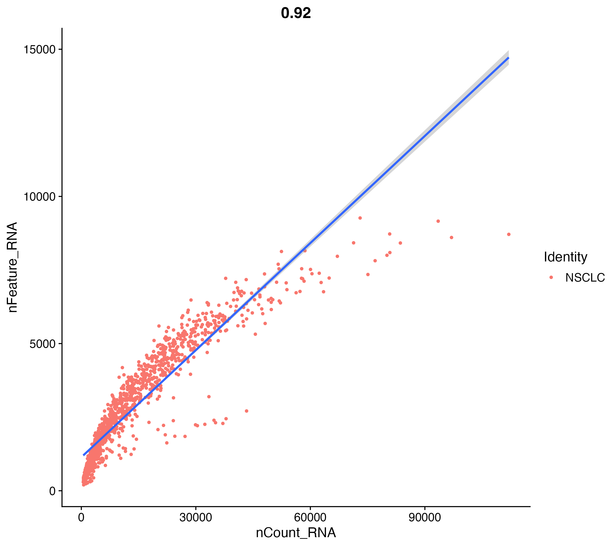
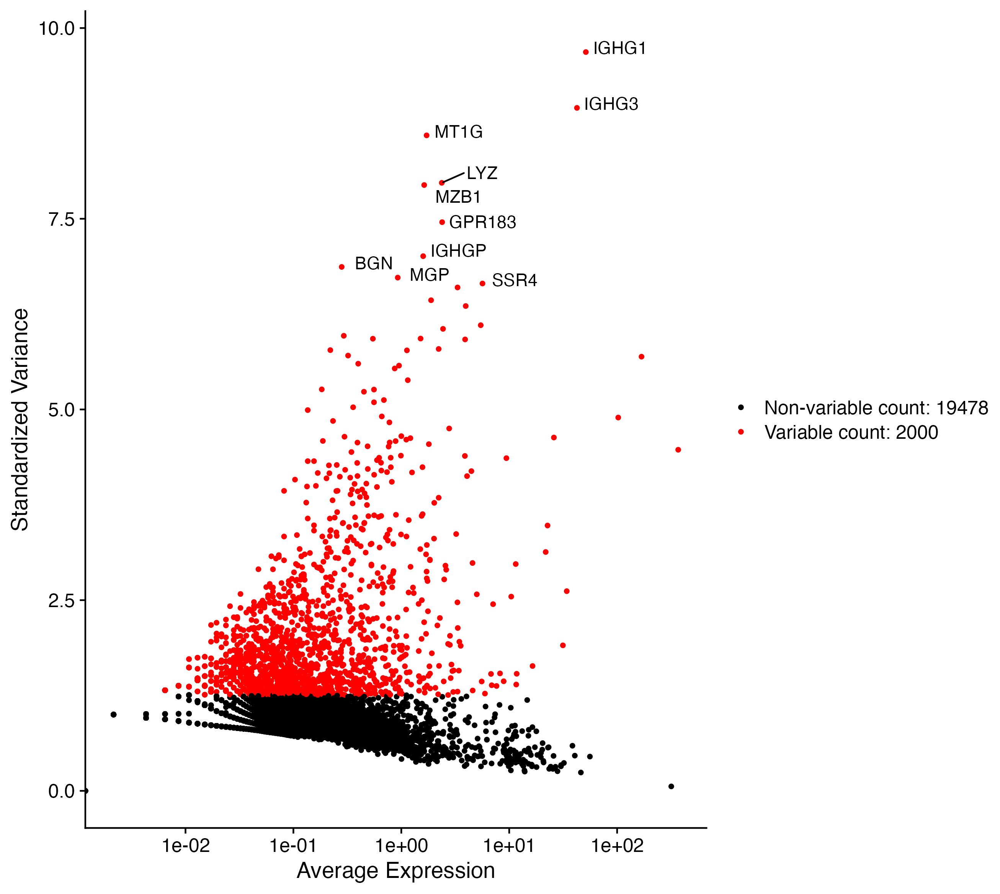
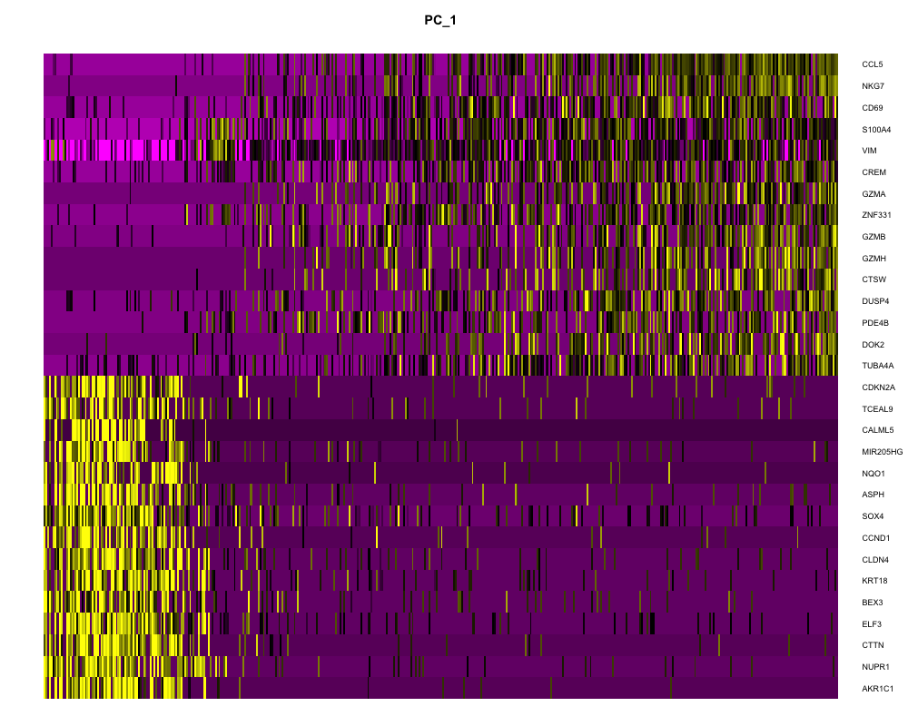

# Single-Cell RNA-seq Analysis of NSCLC Tumor Cells

 **Author**: Riya Dua
 **Dataset**: 20k dissociated tumor cells from NSCLC patients (10x Genomics)  
 **Tool used**: Seurat in R  
 **Goal**: Identify cellular heterogeneity and marker genes

## Objective:
To identify transcriptionally distinct subpopulations within NSCLC tumor samples using single-cell RNA sequencing (scRNA-seq), and characterize them based on their marker gene expression.

## Repository structure:
- `NSCLC_analysis.R`: Seurat pipeline
- `data/`: Data matrix downloaded 
- `figures/`: All saved output plots
- `output/`: Marker gene tables, Seurat object (optional)

## Key Steps:
### 1. Data Import and Quality Control

After downloading the filtered gene-barcode matrix (`.h5` format) from 10x Genomics, I imported the expression data using `Read10X_h5()`, which provides a sparse matrix of raw UMI counts.

Since raw single-cell data contains a mix of high-quality, low-quality, and dying cells, I applied **quality control** filters based on:

- **Number of detected genes per cell (`nFeature_RNA`)** – to remove potential empty droplets or doublets  
- **Total UMI count per cell (`nCount_RNA`)** – to account for sequencing depth  
- **Percentage of mitochondrial gene expression (`percent.mt`)** – high mitochondrial content often indicates stressed or dying cells  

This filtering step ensures that only high-quality, biologically relevant cells are retained for downstream analysis. After filtering, it retained **464 high-quality cells** for analysis.

### 2. Normalization and Variable Feature Detection

To ensure that technical variability (e.g., differences in sequencing depth) does not bias downstream analyses, I applied **log normalization** using `NormalizeData()`. This method scales UMI counts in each cell to a total of 10,000, followed by log-transformation.

Next, I identified the **top 2,000 most variable genes** using the `vst` method via `FindVariableFeatures()`. These genes exhibit the highest cell-to-cell variability and likely drive the biological heterogeneity present in the tumor microenvironment. Focusing on these genes improves the signal-to-noise ratio and enhances the accuracy of dimensionality reduction and clustering.

### 3. PCA and UMAP-Based Clustering

To reduce the dimensionality of the data and highlight major sources of variation, I performed **Principal Component Analysis (PCA)** on the highly variable genes. This compresses the expression matrix into principal components that capture the most significant expression trends.

To determine the optimal number of PCs to use for clustering, I evaluated the **Elbow Plot**, which suggested retaining ~15 PCs.

Based on these PCs, I constructed a **Shared Nearest Neighbor (SNN) graph** using `FindNeighbors()` and then applied the **Louvain algorithm** for unsupervised clustering using `FindClusters()` at multiple resolutions. This identified **transcriptionally distinct cell clusters** representing subpopulations within the NSCLC sample.

Finally, I visualized the clusters using **UMAP (Uniform Manifold Approximation and Projection)** — a non-linear dimensionality reduction technique that preserves both local and global structures in the data, making it ideal for visualizing complex scRNA-seq datasets in 2D space.

### 4. Marker Gene Identification

To characterize each cluster, I used `FindAllMarkers()` to perform **differential gene expression analysis**. This identifies genes that are significantly **upregulated in each cluster** compared to all other cells.

By filtering on adjusted p-values and minimum expression thresholds, I extracted a set of **robust marker genes** that define the identity or functional state of each cluster.

For example, clusters showed enriched expression of genes like **ITGA1**, **TRGC2**, and **LILRB4**, suggesting the presence of diverse epithelial, immune, and stromal populations within the tumor. These findings highlight the **cellular heterogeneity** of NSCLC and provide insight into potential cellular subtypes or states relevant to tumor biology.

## Analysis Pipeline

| Step | Description |
|------|-------------|
| **1. Data Loading** | Read 10x `.h5` matrix using `Read10X_h5()` |
| **2. QC Filtering** | Removed low-quality cells (<200 or >2500 genes, >5% mitochondrial content) |
| **3. Normalization** | Log normalization of raw UMI counts |
| **4. Feature Selection** | Identified top 2,000 highly variable genes |
| **5. Scaling** | Centered and scaled data, regressing out unwanted variation |
| **6. PCA** | Performed linear dimensionality reduction |
| **7. Clustering** | Constructed SNN graph and identified clusters at multiple resolutions |
| **8. UMAP** | Visualized clusters in 2D space |
| **9. Marker Detection** | Identified top marker genes for each cluster |

##  Key Results and Visualizations:

### 🔹 Quality Control

This violin plot shows three critical metrics across all cells before filtering:

**nCount_RNA:** Total UMI counts per cell
- Most cells have between 5,000–30,000 UMIs, with a few outliers exceeding 90,000, possibly indicating doublets.

**nFeature_RNA:** Number of detected genes per cell
- The majority of cells express 1,000–2,500 genes, suggesting good transcriptome coverage.

**percent.mt:** Percentage of reads mapping to mitochondrial genes
- Most cells have <10% mitochondrial content, but some exceed 50%, typically indicating low-quality or dying cells.

Based on this visualization, I applied filtering thresholds to retain cells with:

1. nFeature_RNA between 200 and 2,500
2. percent.mt below 5%

This ensures the downstream analysis is based on high-quality, biologically relevant cells only.

### 🔹 Feature scatter:

This scatter plot compares:

1. nCount_RNA (total UMI counts per cell) on the x-axis
2. nFeature_RNA (number of detected genes) on the y-axis

- Each point represents a single cell. The linear trend shows that as UMI counts increase, the number of detected genes also increases, which is expected. However:
  
- Cells far above the main trendline likely contain many genes per UMI, potentially due to doublets or highly complex transcriptomes.
  
- Cells below the curve may reflect technical noise or low-quality capture.

This plot supports QC decisions by revealing non-linear outliers, helping confirm that the applied thresholds (200–2,500 genes and <5% mitochondrial content) appropriately exclude anomalous cells while retaining biologically meaningful ones.

### 🔹 Variable Feature Plot

- This scatter plot highlights the 2,000 most variable genes across the 464 filtered single cells, identified using the vst method in Seurat.

- Each red dot represents a gene, plotted by its average expression vs. dispersion. Genes with high variability are biologically interesting because they are more likely to reflect true cell-to-cell differences rather than technical noise.

- These variable genes were used as input for:

1. Principal Component Analysis (PCA)
2. Clustering
3. UMAP visualization

Focusing on highly variable features enhances the signal-to-noise ratio and enables more meaningful detection of distinct transcriptional subpopulations within the NSCLC dataset.

### 🔹 PCA Heatmap: Principal Component 1

- This heatmap shows the top gene loadings contributing to Principal Component 1 (PC1), which captures the greatest variance in the dataset.

- Each row is a gene, and each column represents an individual cell. The intensity of yellow indicates the relative expression of each gene in each cell.

Key observations:

1. Distinct blocks of gene expression suggest coordinated transcriptional programs, likely reflecting specific cell subtypes or states.
2. PC1 separates cells based on expression of genes like CCL5, NKG7, GZMB, VIM, and CD69, many of which are involved in immune response, epithelial–mesenchymal transition, or cell signaling.
3. This heatmap helps interpret what biological signals underlie PC1, guiding further analysis and validation of cluster identities.

### 🔹 UMAP Clustering

### 🔹 Marker Gene Heatmap

## Takeaways

- Top markers: ITGA1, TRGC2, LILRB4, FCGR2A
- Strong evidence of epithelial and immune cell populations

## References:
- [Seurat Documentation](https://satijalab.org/seurat/)
- [10x Genomics dataset](https://www.10xgenomics.com/datasets/20k-mixture-of-nsclc-dtcs-from-7-donors-3-v3-1-with-intronic-reads-3-1-standard)

